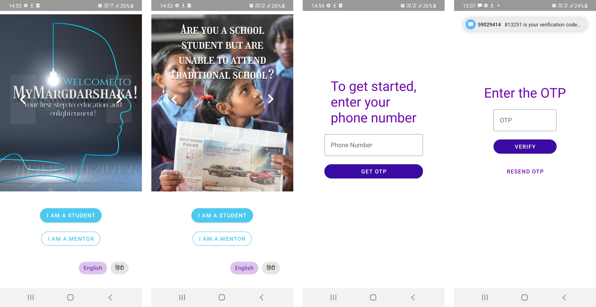
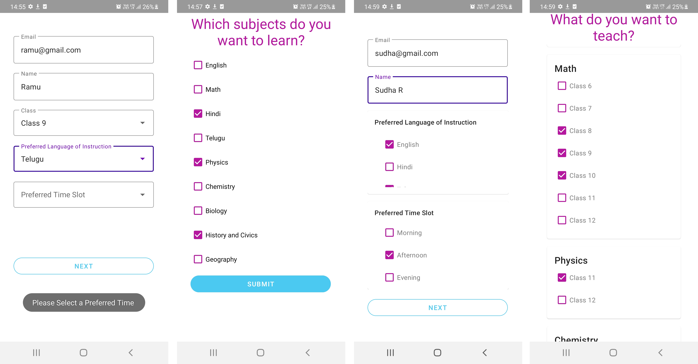
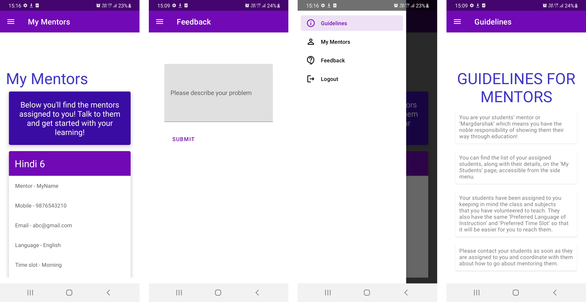

# MyMargdarshaka

The *My Margdarshaka* Android app based on the novel concept of connecting Indian school students who are unable to attend traditional school due to financial or logistic constraints with mentors who want to give back to society by teaching them. The idea is to mentor these students with the goal of taking the class 10 and 12 certification exams conducted by the National Institute of Open Schooling(NIOS) which is the Government of India’s official examination body. The app focuses on the UN SDG 4 - Quality Education. 
_________________________________________________________________
How to run the app

*Alternative 1:* Download the APK

*Alternative 2:* Run it locally on android-studio

1. Clone the repository to your local system using 
    ```
    git clone https://github.com/debesheedas/MyMargdarshaka
    ``` 
2. Then open the repository in android-studio and Build it on your device of choice (either an emulator or phone connected through USB)
________________________________________________________________

User Guide
On the homepage there is a clickable carousel with slides that explain the main idea behind the app. To log in as a student who wants to connect with a mentor, click on the **I AM A STUDENT** button. Similarly for mentors, click on the **I AM A MENTOR** button. Login using mobile number and OTP authentication. 



For first time users, after login, there are different sign up requirements for both students and mentors. Enter details such as name, email address, class, subject, preferred language of instruction and preferred time slot.
For mentors, there is an additional test, to provide a basic check on the quality of the mentor.



After a successful sign up, students are matched with compatible mentors available and their details are provided to the student in the **My Mentors** page. Similarly, for mentors, the students are assigned based on the criteria such as subject, class, preferred language and time slot. The details of these students are presented in the **My Students** page. Separate Guidelines are provided for both mentors and students. The menu provides options to navigate, an option for providing Feedback, and to logout. Feedback is collected and stored in the database.


___________________________________________________________________

Technologies used
1. //not sure what to list here android studio? Firebase?...@Shreetesh could you please do it

