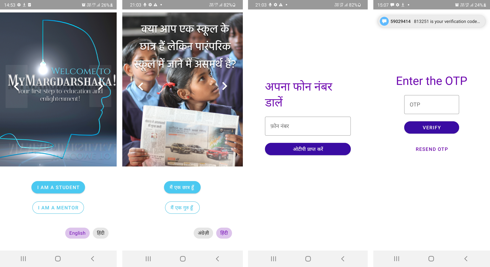

<p>
  &emsp;
  &emsp;
  
</p>

# MyMargdarshaka

***Effective digital tutelage in 
the Indian context: Making 
the right connections***

[YouTube Link for Demo Video](https://www.youtube.com/watch?v=ynh7FvvLrcI)


The *My Margdarshaka* Android app based on the novel concept of connecting Indian school students who are unable to attend traditional school due to financial or logistic constraints with mentors who want to give back to society by teaching them. The idea is to mentor these students with the goal of taking the class 10 and 12 certification exams conducted by the National Institute of Open Schooling (NIOS) which is the Government of India’s official examination body. The app focuses on the UN SDG 4 - Quality Education. 
_________________________________________________________________
## Run the App

*Alternative 1:* Download the APK from the [releases](https://github.com/debesheedas/MyMargdarshaka/releases) section or click [here](https://github.com/debesheedas/MyMargdarshaka/releases)

*Alternative 2:* <details>
    <summary>Run it locally on Android Studio</summary>
  <br>
    To run it locally,
1. Clone the repository to your local system using
  
   ```bash
   git clone https://github.com/debesheedas/MyMargdarshaka
   ``` 
2. Then open the repository in Android Studio and Build it on your device of choice (either an emulator or phone connected through USB). [Please read the following note if you're building it from source](https://github.com/debesheedas/MyMargdarshaka#Note)
    </details>
________________________________________________________________

## User Guide and Features
The app is available in both English and Hindi. You can switch languages using option in the homepage or in the App Bar. On the homepage there is a clickable carousel with slides that explain the main idea behind the app. To login as a student who wants to connect with a mentor, click on the **I AM A STUDENT** button. Similarly for mentors, click on the **I AM A MENTOR** button. Login using mobile number and OTP authentication. 



For first time users, there are different sign up requirements for both students and mentors. Enter details such as name, email, class, subject, preferred language of instruction and preferred time slot.
For mentors, there is an additional test, to provide a basic check on the quality of the mentor.


After a successful sign up, students are matched with compatible mentors available and their details are provided to the student in the **My Mentors** page. Similarly, for mentors, the students are assigned based on the criteria such as subject, class, preferred language and time slot. The details of these students are presented in the **My Students** page. Separate Guidelines are provided for both mentors and students. The menu provides options to navigate, an option for providing Feedback, and to logout. Feedback is collected and stored in the database.


### Test
Mentors are required to clear the test which contains questions from high school. However, they are free to attempt the upto 5 times beyond which they will not be allowed in the platform.

</img>

## Data Flow

The first screen presents you with a set of images that describe what the app is about. There, you can choose to sign in as a student or as a mentor. Based on their choice, the type of user is recorded and transferred in the backend. Now comes the login part, the user enters their phone number, which is also passed to the server. An OTP is generated by Firebase Authentication API which is then verified at the next screen. If they haven’t registered already, we’ll collect the necessary information from the user and store them in the database. If they are a student, mentors will be assigned to them following the algorithm mentioned above. If they are a mentor, we’ll do a quick check if they have cleared the test. A random sample of simple questions are selected from a pool. Based on a threshold score, the mentors will be decided if they’re eligible. If they have cleared the test, they are taken to the page where they can find the students assigned to them, also from the aforementioned algorithm. A feedback button is also provided to the users and potentially be moderated.
___________________________________________________________________

## Technologies Used
* Java and XML for structure, functionality and UI.
* Firebase for database and authentication.
* Material theme library for UI components.
___________________________________________________________________

## Note
If built locally, in order to see the authentication in action, please follow these steps on Android Studio:
* On the right panel, click on ```Gradle``` ➝ expand ```Tasks``` ➝ expand ```android``` ➝ double tap ```signiningReport```.
* In the console below, copy **SHA1** key.
* Navigate to [Firebase Project Console Settings](https://console.firebase.google.com/u/1/project/mymargdarshaka/settings/general/android:com.example.mymargdarshaka), scroll down and under **Your apps**, add your SHA1 figerprint.

*(Currently, this can only be performed by authorized users)*

### Image and Art Attributions
Homepage [Image 1](https://www.gettyimages.in/detail/photo/ideas-royalty-free-image/825412904?adppopup=true)
[Image 2](https://unsplash.com/photos/2eMemvByB-8?utm_source=unsplash&utm_medium=referral&utm_content=creditShareLink)
[Image 3](https://unsplash.com/photos/fIq0tET6llw?utm_source=unsplash&utm_medium=referral&utm_content=creditShareLink)
[Image 4](https://unsplash.com/photos/6jYoil2GhVk?utm_source=unsplash&utm_medium=referral&utm_content=creditShareLink)
[Image 5](https://unsplash.com/photos/pYWuOMhtc6k?utm_source=unsplash&utm_medium=referral&utm_content=creditShareLink)
[Image 6](https://unsplash.com/photos/Q1p7bh3SHj8?utm_source=unsplash&utm_medium=referral&utm_content=creditShareLink)

[Vector Art 1](https://pngtree.com/so/Dotted)
